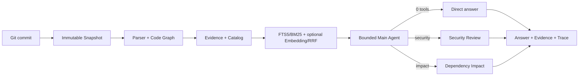

# RepoMind

[中文](README.md)


**A local, read-only, evidence-first Git repository understanding agent.** RepoMind binds analysis to an immutable commit Snapshot, uses structured parsing and hybrid retrieval, and answers repository questions with file, source-line, Evidence ID, and Main Agent Trace references.

| What is different | RepoMind's approach |
| --- | --- |
| Version consistency | Catalog, symbols, relations, Evidence, and answers stay on one Commit Snapshot |
| Traceable answers | Every answer can link back to source files, line ranges, Evidence IDs, and a persisted Trace |
| Bounded agent behavior | Direct explanations use zero tools; security or impact questions use at most one read-only Specialist Tool |


## Fastest way to experience it

### Inspect a real run without starting the app

- [~32-second runtime GIF](docs/assets/repomind-showcase.gif)
- [Post-fix Trace](examples/outputs/repomind-demo-trace.post-fix.json)
- [FastAPI Demo capture](examples/benchmarks/demo-evidence-capture-post-fix.json)
- [Markdown metrics report](examples/benchmarks/demo-evidence-report-post-fix.md)

### Run the no-key Demo locally

Requires Windows, Python 3.11+, and Node.js 20+:

```powershell
git clone https://github.com/sail0kevin/Repository-Mind.git
cd Repository-Mind
python -m venv .venv
.\.venv\Scripts\Activate.ps1
pip install -r backend/requirements.txt

cd desktop/app
npm ci
npm run dev
```

Click **打开内置 Demo**. Snapshot, Catalog/Repo Map, lexical retrieval, rule-based answers, Evidence, and Trace work without Chat or Embedding credentials.

### Connect a Coding Agent through MCP

RepoMind can also run as an independent, read-only MCP Server that gives an external Coding Agent bounded access to repository overviews, code evidence, symbols, impact candidates, and related tests:

```powershell
cd backend
python -m service.mcp_server
```

The MCP process does not require FastAPI to remain running, does not execute target-repository code, and exposes no file-editing or shell tools. Claude Code has been verified with a real client. Codex can use the standard `stdio` MCP configuration, but has not completed end-to-end validation in the current environment. See the [MCP Server guide](docs/MCP_SERVER.md).

The Windows Setup build can use the bundled `resources\backend\repomind-backend.exe --mcp` directly, without a separate Python installation. Call `list_repositories` first to discover indexed repositories, then use the other five code-context tools.

<details>
<summary><strong>Build Windows Setup / Portable artifacts</strong></summary>

```powershell
pip install -r backend/requirements-build.txt
.\scripts\package_windows.ps1 -PythonCommand python -Release
```

This is the same packaging chain used by the Windows Release workflow. It does not imply that a public GitHub Release exists; current builds are unsigned.

</details>

## Representative questions

| Question | Actual route | Key evidence |
| --- | --- | --- |
| `What does GreetingService.build_message do?` | zero tools | definition, README, and test |
| `security token risk` | `security_review` | `repomind_demo/security_examples.py` |
| `Changing GreetingService.build_message impact call chain and tests` | `dependency_impact` | definition, entrypoint reference candidate, and test |

## Real no-key Demo results

Measured from a real FastAPI `register → ingest → ask → trace` run:

| Item | Result |
| --- | ---: |
| Snapshot | `8c5ac33542fbed5e117bfee19af1457e60bd166c` |
| Mode | `lexical-only/no-key-fallback` |
| Recall@5 / Recall@10 | 0.667 / 0.667 |
| MRR | 0.833 |
| Citation hit rate / precision | 1.000 / 0.750 |

Pre-fix → post-fix: Recall@5 `0.556 → 0.667`, MRR `0.667 → 0.833`, and citation hit rate `0.667 → 1.000`.

> **Scope:** three synthetic questions measuring cited-path hits—not general accuracy or production performance. Instance-method call edges remain incomplete, so entrypoint/test references are candidates, not proven edges. No controlled P50/P95 data is available.

A separate benchmark contains **40 human-labeled code-understanding tasks across five categories** against RepoMind's own backend. The current lexical baseline has Recall@5 `0.267`, MRR `0.245`, and **22/40** answers cite at least one human-labeled key evidence path, for a `55%` task-completion rate. The report deliberately exposes weak cross-file overview, test-location, and security-review cases instead of presenting the three-question Demo as a general result. Inspect the [Gold labels](examples/benchmarks/backend-understanding-gold.json), [real Capture](examples/benchmarks/backend-understanding-capture-v2.json), and [per-query report](examples/benchmarks/backend-understanding-report-v2.md).

```powershell
python scripts/capture_demo_evidence.py
python scripts/report_retrieval_metrics.py examples/benchmarks/demo-evidence-capture-post-fix.json --format markdown
```

## Architecture



Repo Map narrows scope; BM25/optional Embedding retrieve candidates; RRF and structural signals fuse them; EvidenceAssembler applies total, item, and file budgets.

## Evidence and Trace

<table>
  <tr>
    <td width="50%">
      
      <p align="center"><strong>Snapshot-bound source Evidence</strong></p>
    </td>
    <td width="50%">
      
      <p align="center"><strong>Auditable Main Agent Trace</strong></p>
    </td>
  </tr>
</table>

## Verification

- Backend: `cd backend; python -m pytest -q` → **168 passed**, including **9 MCP tests**
- Desktop: `npm test -- --run` → **63 passed** across 11 test files
- Desktop: `npm run build` → Vite renderer and Electron TypeScript passed
- Frozen MCP: the packaged backend starts with `--mcp`, lists six read-only tools, and completes repository discovery
- Packaged Demo: real Electron flow covers ingest, zero/one-tool routing, Evidence, Trace, and exports, then verifies that the bundled MCP process discovers the repository from the same desktop index database

Windows CI rebuilds the frozen backend and Electron package in a clean environment and runs the packaged-app E2E. See GitHub Actions for the current commit status. Signed binaries and a published Release are not claimed.

## Safety and limitations

- Target repositories stay read-only: no code execution, edits, commits, pushes, or PRs.
- Each request uses at most one narrow read-only Specialist Tool.
- Remote Chat/Embedding can send retrieved Evidence to the configured Base URL; custom endpoints are user-selected trust boundaries.
- Local-instance type propagation and some call edges remain incomplete; static clues are not runtime facts or a full audit.
- There is no large-repository benchmark or controlled latency study yet.

See [SECURITY.md](SECURITY.md) for the complete data boundary.

## Documentation

- [Development and verification report](docs/后续开发指导/DEVELOPMENT_REPORT.md)
- [Architecture and roadmap](docs/后续开发指导/ARCHITECTURE_FUTURE_ROADMAP.md)
- [Evaluation and resume claim boundaries](docs/后续开发指导/RESUME_EVIDENCE_PLAN.md)
- [RAG versus bounded agent responsibilities](docs/后续开发指导/RAG_VS_AGENTIC.md)
- [MCP Server guide](docs/MCP_SERVER.md)

Next: expand real-repository evaluation and Coding Agent Token A/B comparisons → create a Tag/Release only after explicit approval → add a production icon and Windows code signing.
