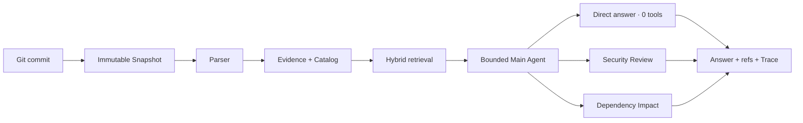

# RepoMind

RepoMind is a local, Windows-first Git repository knowledge assistant. It turns a commit into an immutable Snapshot, builds structured Evidence and a Catalog, and answers repository questions with file, line, commit, and Main Agent Trace references.

It is not an auto-coding tool: it does not execute the target repository, edit files, commit changes, or create pull requests. The Legacy multi-role screen is compatibility/demo UI; the core path is one bounded Main Agent that may select zero or one read-only Specialist Tool.

## The two core layers

1. **Evidence/RAG layer** — Snapshot → Parser → Evidence/Catalog → FTS5/BM25, optional Embedding, and RRF fusion.
2. **Bounded Agent layer** — deterministic routing to a direct answer (zero tools), `security_review`, or `dependency_impact`, followed by a persisted Trace.

### Why a collaboration layer?

Repository overview, local explanation, security clues, and impact analysis need different evidence scopes and output constraints. A free-form single model is difficult to reproduce and audit, so the Main Agent owns Snapshot selection, evidence budgets, and synthesis, then delegates to at most one narrow Specialist Tool. This is observable, bounded collaboration—not a multi-agent chat room. The two core layers are the Evidence/RAG layer and the Main Agent/tool layer.



## Real demo

The bundled Demo is pinned to `8c5ac33542fbed5e117bfee19af1457e60bd166c`. A local run with no network, Chat key, or Embedding key produced a successful Snapshot for `main`, 10 files, and 150 knowledge chunks.


<table>
  <tr>
    <td width="50%">
      
      <p align="center"><strong>Snapshot-bound Catalog Tree</strong></p>
    </td>
    <td width="50%">
      
      <p align="center"><strong>Repository Q&amp;A with Evidence</strong></p>
    </td>
  </tr>
  <tr>
    <td width="50%">
      
      <p align="center"><strong>Snapshot-bound source evidence</strong></p>
    </td>
    <td width="50%">
      
      <p align="center"><strong>Auditable Main Agent Trace</strong></p>
    </td>
  </tr>
</table>

Real runtime sequence (about 32 seconds):


Public artifacts: [`examples/outputs/repomind-demo-report.md`](examples/outputs/repomind-demo-report.md) and [`examples/outputs/repomind-demo-trace.json`](examples/outputs/repomind-demo-trace.json).

## Desktop experience

Repository access, Workbench, workflow analysis, and the command palette were captured from the same bundled Demo run. The responsive view shows the “仓库与目录” and “Evidence 与状态” drawer entry points at a medium-narrow window width.

<table>
  <tr>
    <td width="50%">
      
      <p align="center"><strong>Repository access and bundled Demo</strong></p>
    </td>
    <td width="50%">
      
      <p align="center"><strong>Workflow analysis and export</strong></p>
    </td>
  </tr>
  <tr>
    <td width="50%">
      
      <p align="center"><strong>Ctrl+K command palette</strong></p>
    </td>
    <td width="50%">
      
      <p align="center"><strong>Responsive Workbench</strong></p>
    </td>
  </tr>
</table>

## Quick start

Runtime dependencies for the app are in `backend/requirements.txt`. Install `backend/requirements-dev.txt` additionally only for development or tests.

```powershell
cd repo-knowledge-assistant
python -m venv .venv
.\.venv\Scripts\Activate.ps1
pip install -r backend/requirements.txt
# Before backend tests: pip install -r backend/requirements-dev.txt
cd desktop/app
npm ci
npm run dev
```

Click **打开内置 Demo** in the desktop app. Lexical-only indexing and no-key fallback work without model credentials.

## Verification

The following results are **local working-tree validation**, not GitHub Actions run results:

- Backend: `python -m pytest -q backend/tests` → **122 passed** (60 warnings).
- Desktop: `npm test -- --run` → **53 passed** across 6 test files.
- Desktop build: `npm run build` passed (Vite renderer and Electron TypeScript).
- Frozen backend smoke passed for schema, FTS5, no-key fallback, process cleanup, and file locks.
- Demo routing was verified locally: local explanation uses zero tools; security uses only `security_review`; impact uses only `dependency_impact`; missing traces return 404; opening the Demo twice is idempotent.

Windows CI is configured for pushes to `public-main`, `main`, and `master`, for pull requests, and for manual dispatch. Its status must be taken from an actual GitHub Actions run. This README does not claim that remote CI is green, that binaries are signed, or that a GitHub Release has been published.

## Downloads, installation, and removal

The repository includes a Windows Release workflow, but that **does not mean a downloadable GitHub Release already exists**. After a maintainer publishes one, use the repository's **Releases** page and download the matching files:

- `RepoMind-<version>-x64-setup.exe`: Setup installer with an installation wizard and selectable directory;
- `RepoMind-<version>-x64-portable.exe`: portable single-file build; no installation is required;
- `SHA256SUMS.txt`: SHA-256 checksums for that release's artifacts.

Verify downloads in PowerShell. Each result must exactly match the corresponding entry in `SHA256SUMS.txt`:

```powershell
Get-FileHash .\RepoMind-<version>-x64-setup.exe -Algorithm SHA256
Get-FileHash .\RepoMind-<version>-x64-portable.exe -Algorithm SHA256
```

Current builds are unsigned. Windows SmartScreen may report an unknown publisher or block the first launch. First confirm that the file came from this repository's Releases page and verify its SHA-256. Do not run it if the source is uncertain or the hash differs. If both checks pass, use **More info** and decide whether to **Run anyway**. Bypassing an unsigned warning is not a security guarantee.

Remove the Setup edition through **Windows Settings → Apps → Installed apps → RepoMind → Uninstall**. For the portable edition, exit RepoMind and delete the downloaded executable. User data for either edition is stored separately at `%APPDATA%\repomind-desktop` by default, so uninstalling or deleting the executable may leave Snapshots, indexes, settings, and saved credentials behind. Back up anything needed, exit RepoMind, and delete that directory manually only when you want to remove all local data.

## Security and data boundary

RepoMind is read-only with respect to the target repository and never executes its code. Use a temporary `REPOMIND_USER_DATA_PATH` for development, tests, and screenshots. Do not commit databases, logs, credentials, or build output.

When Chat or Embedding is enabled, RepoMind sends the repository Evidence retrieved for the request—which may include source code, paths, configuration excerpts, and the question—to the user-configured Base URL, together with the corresponding API key as required by that API. An arbitrary custom endpoint is a local-user trust boundary: configure only HTTPS services you trust, and do not send private repository evidence or credentials to an untrusted endpoint. See [`SECURITY.md`](SECURITY.md) for the detailed boundary and reporting guidance.

## Contributions and roadmap

Issues and pull requests are welcome for parsers, retrieval quality, evidence explainability, and Windows UX. Please do not upload private repositories or secrets. The next steps are to observe the first remote Windows CI run, create a version tag and GitHub Release only after explicit approval, and later add a real application icon and Windows code signing.
