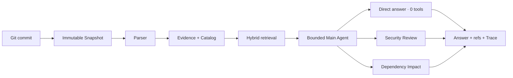
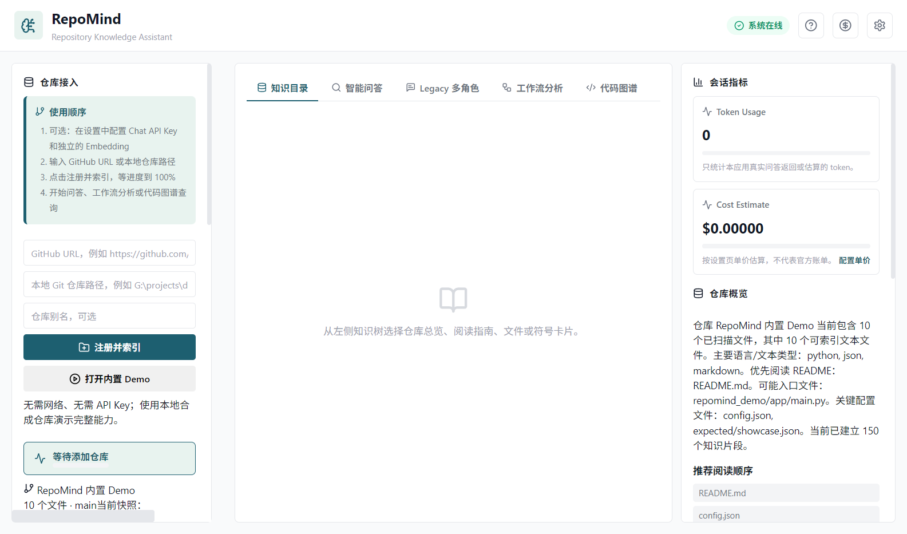
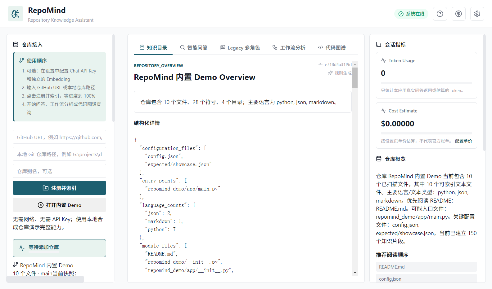
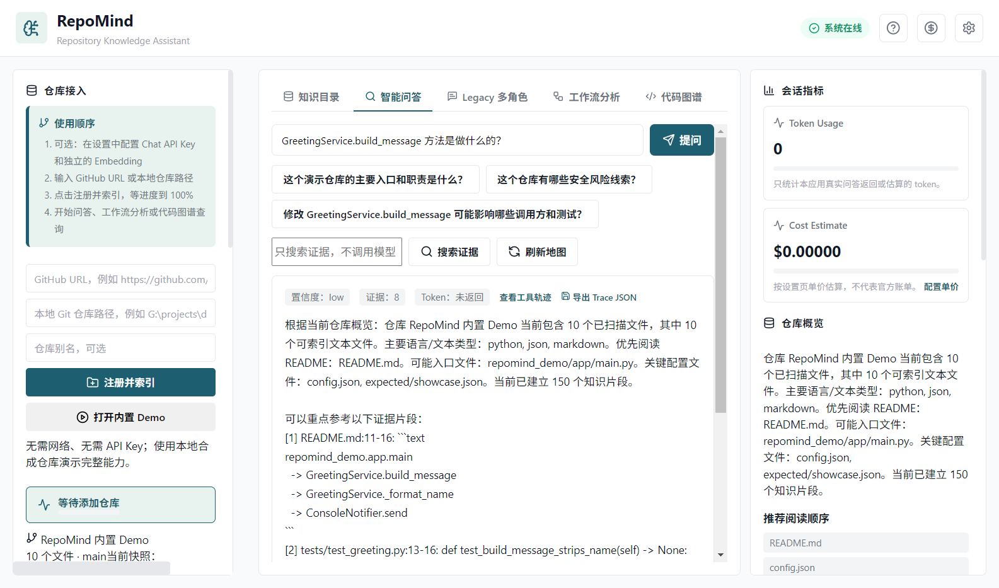
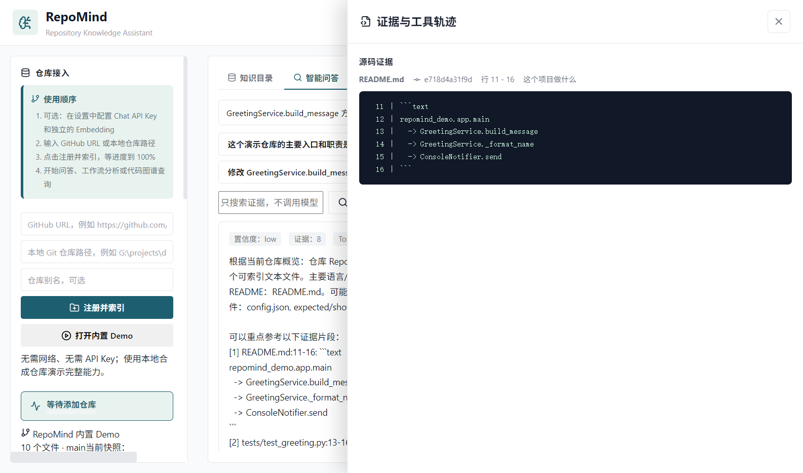
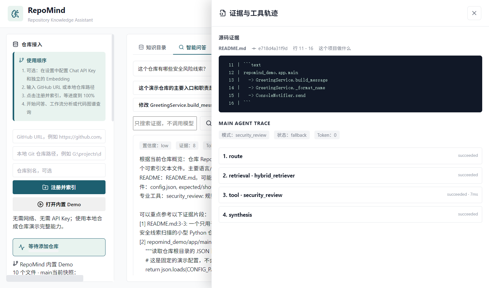
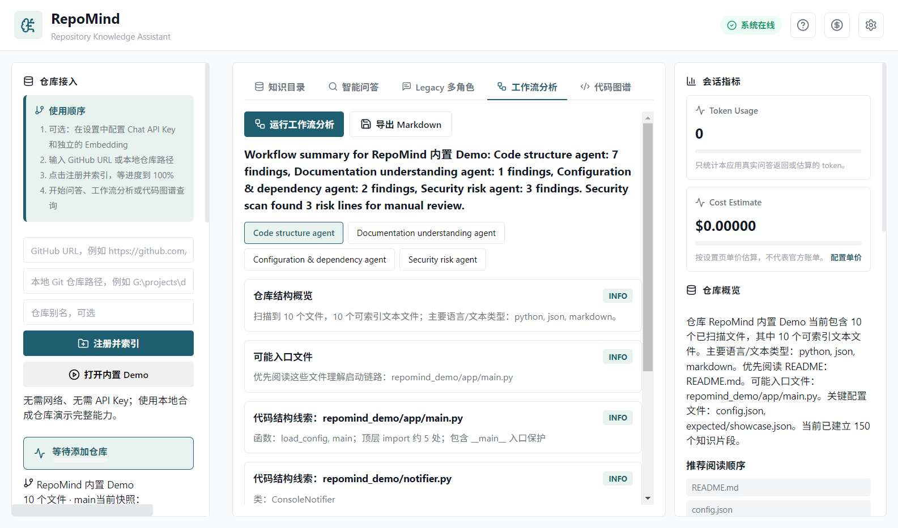

# RepoMind

RepoMind is a local, Windows-first Git repository knowledge assistant. It turns a commit into an immutable Snapshot, builds structured Evidence and a Catalog, and answers repository questions with file, line, commit, and Main Agent Trace references.

It is not an auto-coding tool: it does not execute the target repository, edit files, commit changes, or create pull requests. The Legacy multi-role screen is compatibility/demo UI; the core path is one bounded Main Agent that may select zero or one read-only Specialist Tool.

## The two core layers

1. **Evidence/RAG layer** — Snapshot → Parser → Evidence/Catalog → FTS5/BM25, optional Embedding, and RRF fusion.
2. **Bounded Agent layer** — deterministic routing to a direct answer (zero tools), `security_review`, or `dependency_impact`, followed by a persisted Trace.



## Real demo

The bundled Demo is pinned to `e718d4a31f9df9d74b8b74fe5f5e49b92625862b`. A local run with no network, Chat key, or Embedding key produced a successful Snapshot for `main`, 10 files, and 150 knowledge chunks.









Public artifacts: [`examples/outputs/repomind-demo-report.md`](examples/outputs/repomind-demo-report.md) and [`examples/outputs/repomind-demo-trace.json`](examples/outputs/repomind-demo-trace.json).

## Quick start

```powershell
cd repo-knowledge-assistant
python -m venv .venv
.\.venv\Scripts\Activate.ps1
pip install -r backend/requirements.txt
cd desktop/app
npm ci
npm run dev
```

Click **打开内置 Demo** in the desktop app. Lexical-only indexing and no-key fallback work without model credentials.

## Verification

- Backend: `pytest -q backend/tests` → **92 passed**.
- Desktop: `npm test -- --run` → **24 passed**.
- Desktop build: `npm run build` passed.
- Frozen backend smoke passed for schema, FTS5, no-key fallback, process cleanup, and file locks.
- Demo routing verified: local explanation uses zero tools; security uses only `security_review`; impact uses only `dependency_impact`; missing traces return 404; opening the Demo twice is idempotent.

These are local observations, not a claim that remote CI, signed installers, or a formal Release is complete.

## Security and contribution

RepoMind is read-only with respect to the target repository and never executes its code. Use a temporary `REPOMIND_USER_DATA_PATH` for development and screenshots. Do not commit databases, logs, credentials, or build outputs. See [`SECURITY.md`](SECURITY.md) for the disclosure boundary.

Issues and pull requests are welcome for parsers, retrieval quality, evidence explainability, and Windows UX. Please do not upload private repositories or secrets. The next milestones are export polish, bilingual docs, Windows E2E/remote CI, and signed Portable/NSIS artifacts.
