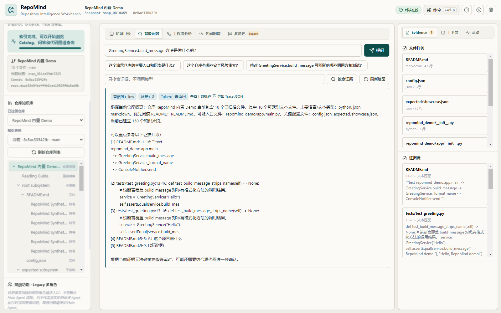
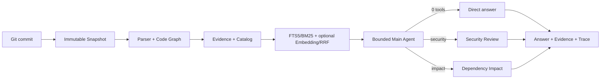
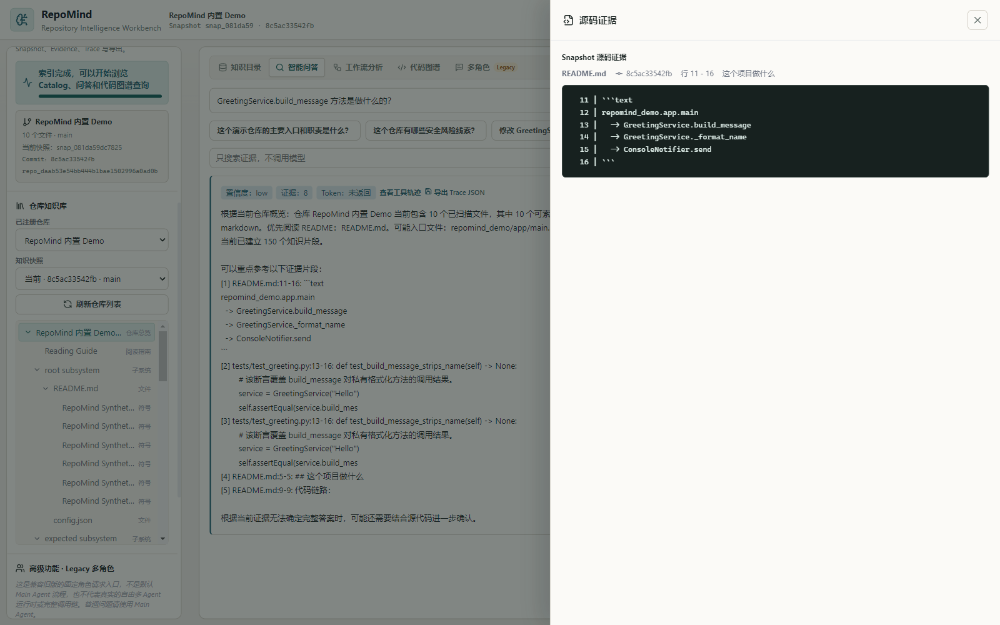
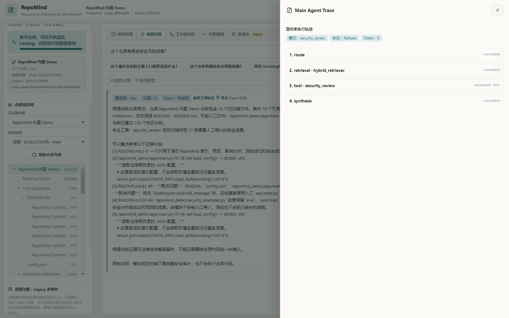

# RepoMind

[English](README.en.md)


**本地、只读、证据优先的 Git 仓库代码理解 Agent。** RepoMind 将指定 commit 固定为不可变 Snapshot，通过结构化解析、混合检索和受约束工具回答“代码做什么、风险在哪里、改动影响谁”，并把结论追溯到文件、源码行与完整 Trace。

| 核心差异 | RepoMind 的做法 |
| --- | --- |
| 版本一致性 | Catalog、符号、关系、Evidence 与回答全部绑定同一 Commit Snapshot |
| 证据可追溯 | 每个回答保留文件路径、源码行、Evidence ID 和 Main Agent Trace |
| Agent 有边界 | 普通解释使用 0 工具；安全或影响问题至多调用一个只读 Specialist Tool |



## 最快体验

### 不运行程序，直接看真实结果

- [约 32 秒的真实运行 GIF](docs/assets/repomind-showcase.gif)
- [修复后的 Trace](examples/outputs/repomind-demo-trace.post-fix.json)
- [FastAPI Demo capture](examples/benchmarks/demo-evidence-capture-post-fix.json)
- [Markdown 评测报告](examples/benchmarks/demo-evidence-report-post-fix.md)

### 本地运行无 Key Demo

需要 Windows、Python 3.11+、Node.js 20+：

```powershell
git clone https://github.com/sail0kevin/Repository-Mind.git
cd Repository-Mind
python -m venv .venv
.\.venv\Scripts\Activate.ps1
pip install -r backend/requirements.txt

cd desktop/app
npm ci
npm run dev
```

打开桌面端后点击“打开内置 Demo”。不配置 Chat 或 Embedding Key，也能完成 Snapshot、Catalog/Repo Map、词法检索、规则回答、Evidence 和 Trace。

### 接入 Claude Code 等 Coding Agent

RepoMind 也可以作为独立的只读 MCP Server，把已索引仓库的概览、代码片段、符号关系、影响范围和测试候选按需提供给外部 Coding Agent：

```powershell
cd backend
python -m service.mcp_server
```

MCP Server 不依赖 FastAPI 常驻，不执行目标仓库代码，也不提供文件修改或 Shell 工具。Claude Code 已完成真实客户端验证；Codex 可使用标准 `stdio` MCP 配置，但当前环境尚未完成端到端实测。配置与限制见 [MCP Server 使用指南](docs/MCP_SERVER.md)。

<details>
<summary><strong>构建 Windows Setup / Portable</strong></summary>

```powershell
pip install -r backend/requirements-build.txt
.\scripts\package_windows.ps1 -PythonCommand python -Release
```

该命令使用与 Windows Release workflow 相同的打包链路。它不代表 GitHub Releases 中已经存在公开下载；当前构建也没有 Windows 代码签名。

</details>

## 三个代表性问题

| 问题 | 实际路由 | 关键证据 |
| --- | --- | --- |
| `GreetingService.build_message 方法是做什么的？` | 0 tools | 定义、README 与测试 |
| `security token 安全风险` | `security_review` | `repomind_demo/security_examples.py` |
| `Changing GreetingService.build_message impact call chain and tests` | `dependency_impact` | 定义、入口引用候选与测试 |

普通解释不调用工具；安全问题只调用安全审查；影响问题只调用依赖分析。最终 Ask API、synthesis Trace 和界面展示使用同一组预算化 Evidence。

## 真实无 Key Demo 结果

以下结果来自真实 FastAPI `register → ingest → ask → trace` 三问流程，不是手工填写的排名：

| 项目 | 结果 |
| --- | ---: |
| Snapshot | `8c5ac33542fbed5e117bfee19af1457e60bd166c` |
| 模式 | `lexical-only/no-key-fallback` |
| Recall@5 / Recall@10 | 0.667 / 0.667 |
| MRR | 0.833 |
| Citation hit rate / precision | 1.000 / 0.750 |

修复前后对比：Recall@5 `0.556 → 0.667`，MRR `0.667 → 0.833`，Citation hit rate `0.667 → 1.000`。

> **评测边界：**这只是 3 个问题的 synthetic bundled Demo，衡量的是引用路径命中，不代表大型真实仓库的语义准确率或生产性能。实例方法调用边尚未完整解析，因此入口和测试只标记为“源码引用候选”，不是已证明的调用边；当前也没有受控的 P50/P95 延迟数据。

项目另提供一组针对 RepoMind 自身后端的 **40 条、5 类人工标注代码理解任务**。当前纯词法基线的 Recall@5 为 `0.267`、MRR 为 `0.245`，有 **22/40** 条回答命中至少一条人工标注的关键证据，任务完成率为 `55%`；这组结果如实暴露了跨文件综述、测试定位和安全审查的检索短板，不以小样本 Demo 指标替代真实基线。可直接查看 [Gold 标注](examples/benchmarks/backend-understanding-gold.json)、[真实 Capture](examples/benchmarks/backend-understanding-capture-v2.json) 和 [逐题报告](examples/benchmarks/backend-understanding-report-v2.md)。

复现命令：

```powershell
python scripts/capture_demo_evidence.py
python scripts/report_retrieval_metrics.py examples/benchmarks/demo-evidence-capture-post-fix.json --format markdown
```

## 工作流程



RepoMind 默认不会把整个仓库塞进 Prompt。Repo Map 先缩小范围，BM25/可选 Embedding 找到候选，RRF 与结构关系融合结果，EvidenceAssembler 再限制总 Token、单条证据和单文件占比。

## Evidence 与 Trace

<table>
  <tr>
    <td width="50%">
      
      <p align="center"><strong>Snapshot 绑定的源码证据</strong></p>
    </td>
    <td width="50%">
      
      <p align="center"><strong>可复核的 Agent Trace</strong></p>
    </td>
  </tr>
</table>

## 当前验证

以下是当前工作区的本地结果，不是 GitHub Actions 远端状态：

- Backend：`cd backend; python -m pytest -q` → **167 passed**
- Desktop：`npm test -- --run` → **63 passed**（11 个测试文件）
- Desktop build：`npm run build` → Vite renderer 与 Electron TypeScript 构建通过
- Demo：三类问题分别走 0 tools、仅 `security_review`、仅 `dependency_impact`

Windows CI workflow 已配置，但是否通过必须以 GitHub Actions 的真实运行记录为准。本项目当前不宣称远端 CI 全绿、二进制已签名或 GitHub Release 已发布。

## 安全与限制

- 默认只读目标仓库，不执行其中的代码，不修改文件，不自动 commit、push 或创建 PR。
- Main Agent 每次最多选择一个窄边界只读 Specialist Tool，不是自由无边界的 Multi-Agent 聊天室。
- 开启远程 Chat/Embedding Provider 后，当前请求检索到的 Evidence 可能发送到用户配置的 Base URL；自定义 Endpoint 属于用户主动选择的信任边界。
- Python parser 尚未完整解析局部实例变量的类型传播；静态关系和安全线索不等于运行时事实或完整安全审计。
- 当前评测集规模很小，尚无大型真实仓库 benchmark 和受控延迟数据。

详细数据边界见 [SECURITY.md](SECURITY.md)。

## 文档

- [开发与验证记录](docs/后续开发指导/DEVELOPMENT_REPORT.md)
- [架构与后续路线图](docs/后续开发指导/ARCHITECTURE_FUTURE_ROADMAP.md)
- [评测与简历事实边界](docs/后续开发指导/RESUME_EVIDENCE_PLAN.md)
- [RAG 与受约束 Agent 的分工](docs/后续开发指导/RAG_VS_AGENTIC.md)
- [MCP Server 使用指南](docs/MCP_SERVER.md)

下一步：观察首次远端 Windows CI → 经明确批准后创建 Tag/Release → 扩充真实仓库评测 → 增加正式图标与 Windows 代码签名。
