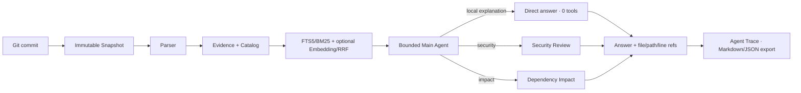
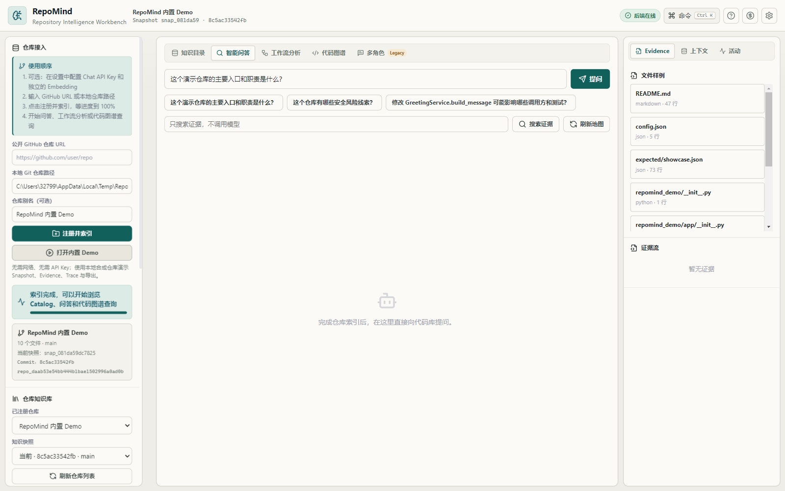
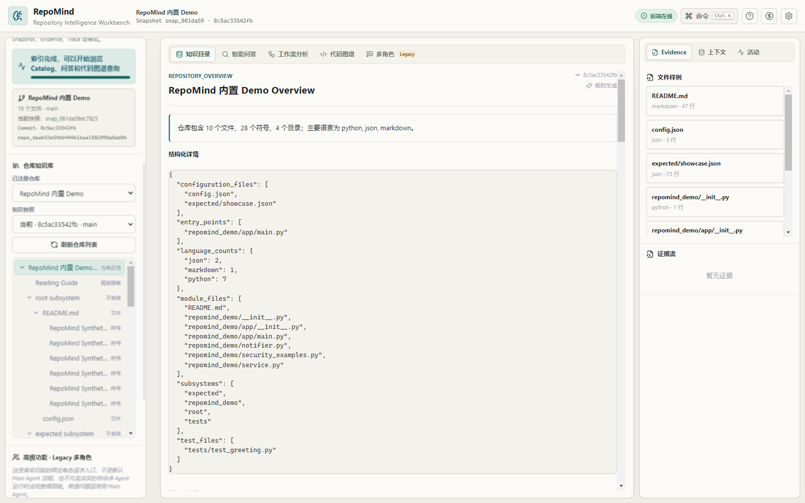
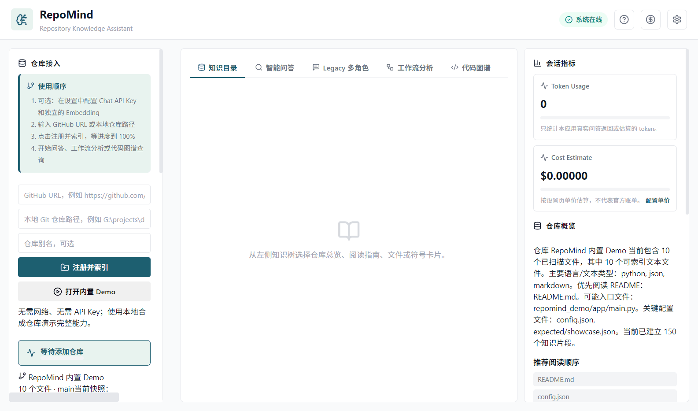
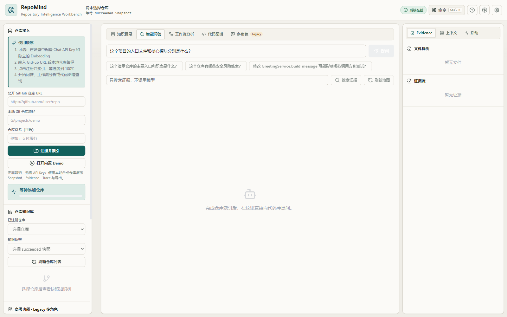
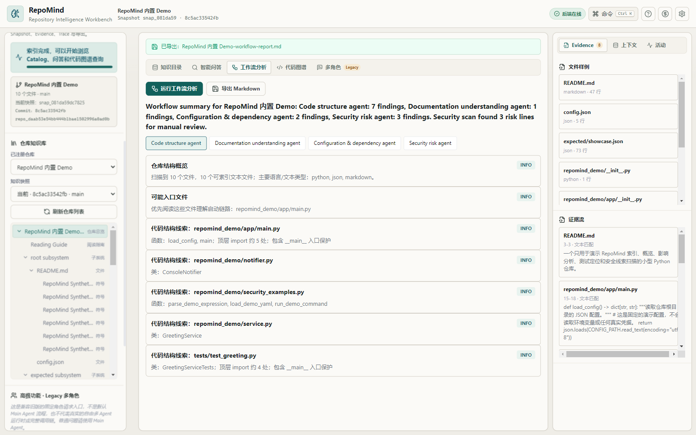
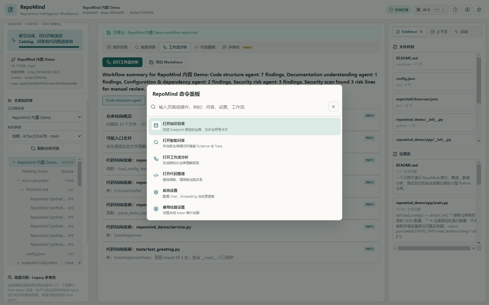
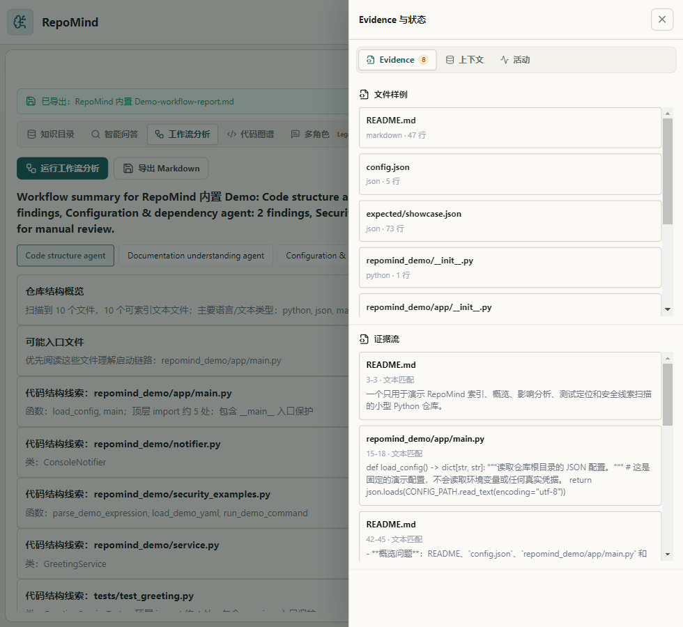

# RepoMind

RepoMind 是一个面向 Windows 的本地 Git 仓库知识助手：把 commit 变成不可变 Snapshot，用结构化 Evidence/Catalog 和混合检索回答“这个仓库是什么、从哪里开始读、改动会影响什么”。每个回答都可以回到 commit、文件路径、源码行和 Main Agent Trace。

它不是自动编程工具：不会执行目标仓库代码，不修改文件，不自动提交或创建 PR，也不是让多个 Agent 自由聊天。Legacy 多角色页面仅保留作兼容展示；主流程是一个有边界的 Main Agent，按规则选择零个或一个只读 Specialist Tool。

## 为什么值得看

这个项目解决的是“读懂陌生仓库”而不是“替你写代码”：

- Snapshot 层把一次 commit 的文件、符号和解析结果固定下来，避免回答混用工作区与历史版本。
- Evidence/Catalog 层把 Markdown、Python、配置等内容统一成可定位证据，支持 FTS5/BM25、可选 Embedding 和 RRF 融合。
- Main Agent 层先做确定性路由：局部解释走 0 工具，安全问题只走 `security_review`，影响问题只走 `dependency_impact`；每次执行都留下 Trace。

### 为什么需要协作层

仓库概览、局部解释、安全线索和影响分析需要不同的证据范围与输出约束。让一个模型自由发挥会难以复现、审计和定位引用；RepoMind 因此让 Main Agent 统一管理 Snapshot、Evidence 预算和最终回答，再按意图委派一个窄边界 Specialist Tool。这里的“多智能体”是可观测的受约束协作，不是多个 Agent 互相编故事的聊天室；代码中的两个核心层分别是 Evidence/RAG 层与 Main Agent/工具层。



## 真实 Demo

内置 Demo 固定在 commit `8c5ac33542fbed5e117bfee19af1457e60bd166c`。在无网络、无 Chat Key、无 Embedding Key 的临时环境中，结果为：`main`、10 个文件、150 个知识片段、Snapshot succeeded、Catalog 可读。



<table>
  <tr>
    <td width="50%">
      
      <p align="center"><strong>Snapshot 与知识目录</strong></p>
    </td>
    <td width="50%">
      
      <p align="center"><strong>带源码证据的仓库问答</strong></p>
    </td>
  </tr>
  <tr>
    <td width="50%">
      
      <p align="center"><strong>Snapshot 绑定的源码证据</strong></p>
    </td>
    <td width="50%">
      
      <p align="center"><strong>可复核的 Main Agent Trace</strong></p>
    </td>
  </tr>
</table>

真实运行状态序列（约 32 秒）：



公开示例产物：[`examples/outputs/repomind-demo-report.md`](examples/outputs/repomind-demo-report.md) · [`examples/outputs/repomind-demo-trace.json`](examples/outputs/repomind-demo-trace.json)

## 桌面体验

仓库接入、工作台、工作流和命令面板均来自同一次内置 Demo 运行；响应式截图展示中窄窗口下的“仓库与目录”和“Evidence 与状态”入口。

<table>
  <tr>
    <td width="50%">
      
      <p align="center"><strong>内置 Demo 与仓库接入</strong></p>
    </td>
    <td width="50%">
      
      <p align="center"><strong>工作流分析与导出</strong></p>
    </td>
  </tr>
  <tr>
    <td width="50%">
      
      <p align="center"><strong>Ctrl+K 命令面板</strong></p>
    </td>
    <td width="50%">
      
      <p align="center"><strong>响应式 Workbench</strong></p>
    </td>
  </tr>
</table>

## 三个最能说明边界的问题

| 问题 | 期望路由 | 展示什么 |
| --- | --- | --- |
| `GreetingService.build_message 方法是做什么的？` | 0 tools | 直接从 Evidence 回答，并打开文件与行号 |
| `这个仓库有哪些安全风险线索？` | `security_review` | 只调用安全工具，Trace 显示 route → retrieval → tool → synthesis |
| `修改 GreetingService.build_message 可能影响哪些调用方和测试？` | `dependency_impact` | 只调用影响分析，展示一跳关系与相关测试 |

## 快速运行

开发环境需要 Windows、Python 3.11+、Node.js 20+。`backend/requirements.txt` 是运行应用所需依赖；只有开发或执行测试时，才另外安装 `backend/requirements-dev.txt`。

```powershell
cd repo-knowledge-assistant
python -m venv .venv
.\.venv\Scripts\Activate.ps1
pip install -r backend/requirements.txt
# 运行后端测试时再执行：pip install -r backend/requirements-dev.txt

cd desktop/app
npm ci
npm run dev
```

打开桌面端后点击“打开内置 Demo”。不配置 Chat/Embedding Key 也能完成 Snapshot、Catalog、lexical 检索、规则回答、Evidence 和 Trace；真实模型调用需要在本地设置页显式配置。

## 当前验证结果

以下是当前工作区的**本地验证**，不是 GitHub Actions 远端运行记录：

- Backend：`python -m pytest -q backend/tests` → **122 passed**（60 warnings）。
- Desktop：`npm test -- --run` → **53 passed**（6 个测试文件）。
- Desktop build：`npm run build`（Vite renderer + Electron TypeScript）通过。
- 冻结后端 smoke：schema、FTS5、无 Key 降级、进程退出和文件锁检查通过。
- Demo 验收：局部问题 0 工具；安全问题仅 `security_review`；影响问题仅 `dependency_impact`；不存在的 Trace 返回 404；重复打开 Demo 幂等。

Windows CI 已配置为在 `public-main`、`main`、`master` push、pull request 和手动触发时运行；是否通过必须以 GitHub Actions 页面中的实际远端记录为准。当前不宣称远端 CI 全绿、安装包已签名或 GitHub Release 已发布。

## 下载、安装与卸载

当前仓库已经提供 Windows Release workflow，但**不代表 GitHub Releases 中已经存在可下载版本**。发布者创建 Release 后，请从仓库的 **Releases** 页面下载与版本对应的文件：

- `RepoMind-<version>-x64-setup.exe`：Setup 安装包，按向导安装，可选择安装目录；
- `RepoMind-<version>-x64-portable.exe`：Portable 单文件版本，无需安装，直接运行；
- `SHA256SUMS.txt`：同一批发布文件的 SHA-256 校验清单。

下载后可在 PowerShell 中校验文件，输出应与 `SHA256SUMS.txt` 中同名文件完全一致：

```powershell
Get-FileHash .\RepoMind-<version>-x64-setup.exe -Algorithm SHA256
Get-FileHash .\RepoMind-<version>-x64-portable.exe -Algorithm SHA256
```

当前构建没有代码签名证书。Windows SmartScreen 可能显示“未知发布者”或阻止首次运行；请先确认下载来源是本仓库的 Releases 页面并核对 SHA-256。无法确认来源或哈希不一致时不要运行。确认无误后，可在 SmartScreen 中选择“更多信息”再决定是否“仍要运行”。这只是处理未签名提示，不等于验证了程序安全。

Setup 版可通过 Windows“设置 → 应用 → 已安装的应用 → RepoMind → 卸载”移除。Portable 版退出程序后删除下载的 EXE 即可。两种版本的用户数据默认独立保存在 `%APPDATA%\repomind-desktop`；卸载或删除 Portable EXE 不一定清除此目录。需要彻底删除历史 Snapshot、索引、设置和已保存凭据时，请先备份所需数据、退出 RepoMind，再手动删除该目录。

## 安全与数据边界

RepoMind 默认只读目标仓库，不执行其中的代码。开发/截图/测试应使用临时 `REPOMIND_USER_DATA_PATH` 和临时数据库；不要提交数据库、日志、密钥或构建产物。

如果启用 Chat 或 Embedding Provider，RepoMind 会把为当前请求检索出的仓库 Evidence（可能包含源码、路径、配置片段和问题文本）发送到用户配置的 Base URL，并按该接口要求发送对应 API Key。任意自定义 Endpoint 都是本地用户主动选择的信任边界：只应配置你信任的 HTTPS 服务，不要把私有仓库证据或密钥发送给不受信任的地址。详细边界与披露方式见 [`SECURITY.md`](SECURITY.md)。

## 文档入口

- [`README.en.md`](README.en.md)：English overview。
- [`docs/后续开发指导/DEVELOPMENT_REPORT.md`](docs/后续开发指导/DEVELOPMENT_REPORT.md)：当前实现与验证记录。
- [`docs/后续开发指导/ARCHITECTURE_FUTURE_ROADMAP.md`](docs/后续开发指导/ARCHITECTURE_FUTURE_ROADMAP.md)：架构与后续路线图。
- [`docs/后续开发指导/RAG_VS_AGENTIC.md`](docs/后续开发指导/RAG_VS_AGENTIC.md)：RAG 与受约束 Agent 的分工。
- [`docs/多模态AI交接/RepoMind_多模态AI展示与发布任务书.md`](docs/多模态AI交接/RepoMind_多模态AI展示与发布任务书.md)：展示与发布验收边界。

## 贡献与路线图

欢迎通过 Issue/PR 讨论解析器、检索质量、Evidence 可解释性和 Windows 体验。请先阅读 [`SECURITY.md`](SECURITY.md) 与任务书的公开边界；不要上传真实私有仓库、凭据或未经脱敏的运行数据。

下一步按优先级推进：观察首次远端 Windows CI → 经明确批准后创建版本 Tag 和 GitHub Release → 增加正式图标与 Windows 代码签名。不会为了展示而增加无边界的新 Agent 或模型 Provider。
