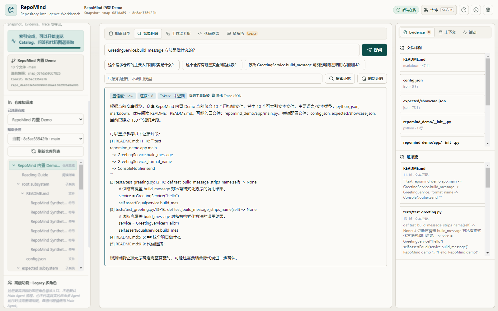
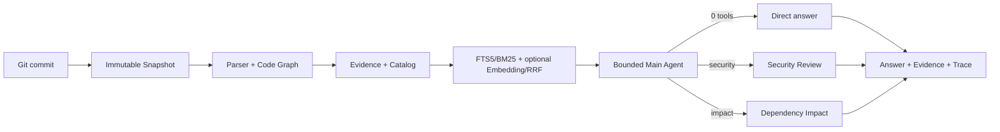
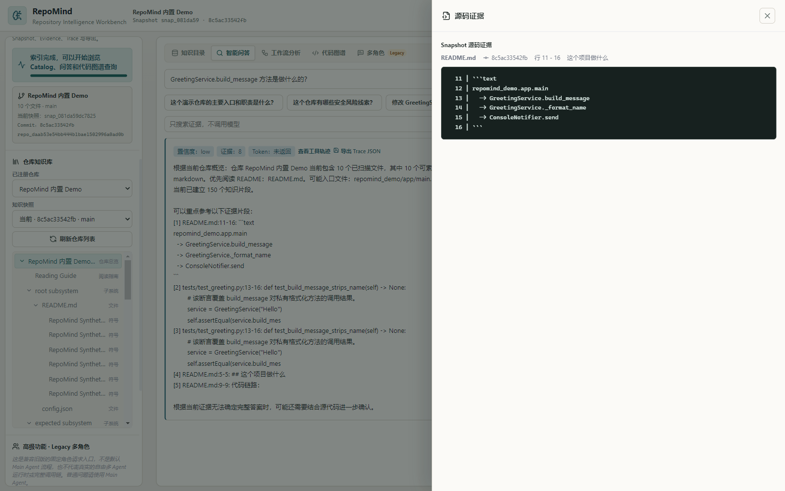
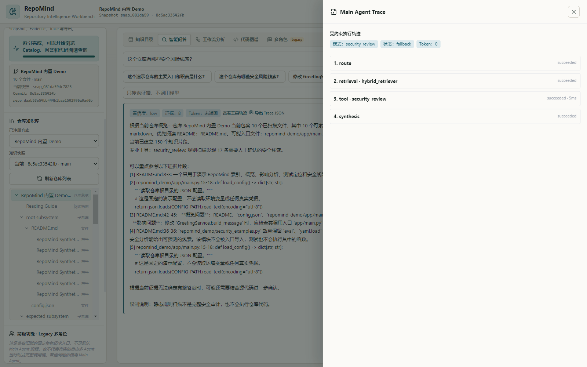

# RepoMind


**面向 Codex、Claude Code 等 Coding Agent 的本地只读代码上下文服务。** RepoMind 先把陌生仓库解析为可检索的符号、关系和代码证据，再通过 MCP 按需返回关键上下文，减少 Agent 反复搜索和整文件读取；外部 Agent 仍负责规划、改代码和运行测试。

| 核心差异 | RepoMind 的做法 |
| --- | --- |
| 版本一致性 | Catalog、符号、关系、Evidence 与回答全部绑定同一 Commit Snapshot |
| 证据可追溯 | 每个回答保留文件路径、源码行、Evidence ID 和 Main Agent Trace |
| 上下文有边界 | MCP 只返回带路径和行号的预算化 Evidence，不提供 Shell 或写文件能力 |



## 最快体验

### 不运行程序，直接看真实结果

- [约 32 秒的真实运行 GIF](docs/assets/repomind-showcase.gif)
- [修复后的 Trace](examples/outputs/repomind-demo-trace.post-fix.json)
- [FastAPI Demo capture](examples/benchmarks/demo-evidence-capture-post-fix.json)
- [Markdown 评测报告](examples/benchmarks/2026-07-20_DEMO_EVIDENCE_POST_FIX_REPORT_修复后演示证据报告.md)

### 本地运行无 Key Demo

需要 Windows、Python 3.11+、Node.js 20+：

```powershell
git clone https://github.com/sail0kevin/Repository-Mind.git
cd Repository-Mind
python -m venv .venv
.\.venv\Scripts\Activate.ps1
pip install -r backend/requirements.txt

cd desktop/app
npm ci
npm run dev
```

打开桌面端后点击"打开内置 Demo"。不配置 Chat 或 Embedding Key，也能完成 Snapshot、Catalog/Repo Map、词法检索、规则回答、Evidence 和 Trace。

### 首次建索引需要多久

RepoMind 不做"边扫边答"——它先把仓库解析成符号、关系和证据，建成可检索的 SQLite 索引（FTS5 词法 + 可选向量），之后的查询全部走索引。**不建索引，`list_repositories` 为空，任何工具都无法返回结果。**

首次建索引耗时（实测，词法/无 Key 模式，数据来源：`index_location_benchmark.py` 与 `runtime-manifest.local.json`）：

| 场景 | 规模 | 实测耗时 |
| --- | --- | --- |
| 内置 demo 仓库 | 10 文件 / 159 chunks | 约 1.5 秒 |
| 中型仓库 | 196 文件 / 8,386 chunks | 约 61 秒 |

启用语义索引（embedding）会显著变慢：每个 chunk 都要调用 embedding 模型生成向量（网络 + 计算密集），同样 196 文件仓库实测约 **5~20 分钟**（依赖 provider 延迟），因此默认不启用。索引建立后，后续查询直接复用，不再重复建。命令行建索引入口会先打印预计耗时，再提示"正在建索引，请不要中断"，最后打印实际耗时与 `repo_id`。

### 接入 Claude Code 等 Coding Agent

RepoMind 也可以作为独立的只读 MCP Server，把已索引仓库的概览、代码片段、符号关系、影响范围和测试候选按需提供给外部 Coding Agent：

```powershell
cd backend
python -m service.mcp_server
```

MCP Server 不依赖 FastAPI 常驻，不执行目标仓库代码，也不提供文件修改或 Shell 工具。Claude Code 与 Codex CLI 均已完成真实客户端调用验证；配置、验证范围与限制见 [MCP Server 使用指南](docs/2026-08-01_MCP_SERVER_GUIDE_MCP服务使用指南.md)。

Windows Setup 安装版内置 demo 预建索引，安装后自动注册到 Claude Code / Codex，重开会话即可用，不需要另装 Python，也不需要手动写配置。连接后先调用 `list_repositories`——它直接返回内置 demo 仓库；索引你自己的仓库可选桌面端导入或 `repomind-backend.exe --index --repo <路径>`。自然语言代码定位优先使用 `locate_code`，再按需调用其余只读工具。

<details>
<summary><strong>构建 Windows Setup / Portable</strong></summary>

```powershell
pip install -r backend/requirements-build.txt
.\scripts\package_windows.ps1 -PythonCommand python -Release
```

该命令使用与 Windows Release workflow 相同的打包链路。链路末尾还会用 Inno Setup（`build_installer.ps1` 自动探测 ISCC.exe，CI 预装）产出 **Windows Setup 安装器** `installer-output\RepoMindSetup-<version>.exe`。它不代表 GitHub Releases 中已经存在公开下载；当前构建也没有 Windows 代码签名。

</details>

## 三个代表性问题

| 问题 | 实际路由 | 关键证据 |
| --- | --- | --- |
| `GreetingService.build_message 方法是做什么的？` | 0 tools | 定义、README 与测试 |
| `security token 安全风险` | `security_review` | `repomind_demo/security_examples.py` |
| `Changing GreetingService.build_message impact call chain and tests` | `dependency_impact` | 定义、入口引用候选与测试 |

普通解释不调用工具；安全问题只调用安全审查；影响问题只调用依赖分析。最终 Ask API、synthesis Trace 和界面展示使用同一组预算化 Evidence。

## 真实无 Key Demo 结果

以下结果来自真实 FastAPI `register → ingest → ask → trace` 三问流程，不是手工填写的排名：

| 项目 | 结果 |
| --- | ---: |
| Snapshot | `8c5ac33542fbed5e117bfee19af1457e60bd166c` |
| 模式 | `lexical-only/no-key-fallback` |
| Recall@5 / Recall@10 | 0.667 / 0.667 |
| MRR | 0.833 |
| Citation hit rate / precision | 1.000 / 0.750 |

修复前后对比：Recall@5 `0.556 → 0.667`，MRR `0.667 → 0.833`，Citation hit rate `0.667 → 1.000`。

> **评测边界：**这只是 3 个问题的 synthetic bundled Demo，衡量的是引用路径命中，不代表大型真实仓库的语义准确率或生产性能。实例方法调用边尚未完整解析，因此入口和测试只标记为"源码引用候选"，不是已证明的调用边；当前也没有受控的 P50/P95 延迟数据。
>
> **Fixture 说明：**上表指标基于旧 demo fixture（commit `8c5ac335`，含空 `README.md`）。安装版捆绑的**预建 demo 索引基于当前 fixture（commit `94d4aa63`，`README.md` 已改名 `OLD_REPOMIND_DEMO_README.md`）**，两者是不同内容，上述指标数字不能直接套用到预建索引上。

## 检索与代码定位评测

项目提供针对 RepoMind 自身后端的 **40 条、5 类人工标注代码理解任务**。纯词法基线 Recall@5 为 `0.267`、MRR 为 `0.245`，任务完成率 `55%`；该基线如实暴露了跨文件综述、测试定位和安全审查的检索短板。基于 BGE-M3 的混合检索（BM25 + Embedding + RRF）实验配置将 Recall@5 提升到 `0.440`，且未出现未解释的类别回退；它仍是冻结实验契约下的候选配置，需持续回归，不能替代真实用户验收。Gold 标注、真实 Capture 和逐题报告见 [backend-understanding-gold.json](examples/benchmarks/backend-understanding-gold.json)、[capture-v2](examples/benchmarks/backend-understanding-capture-v2.json) 与 [逐题报告](examples/benchmarks/2026-07-25_BACKEND_UNDERSTANDING_REPORT_V2_后端理解评测报告V2.md)。

工具级代码定位质量以固定 manifest 基准为准：生产 `locate_code` 在同一组 5 个标注代码位置上 lexical 通过 `5/5`，gold-location coverage `1.000`，mean reciprocal rank `0.578`。该基准直接评估工具返回的位置；与外部 Agent A/B 的最终采纳行为、上下文消耗和任务完成率测量对象不同，不能将两组数字混为同一指标。

## MCP Token 外部 A/B

在 Click、Typer、Requests 三个陌生仓库、两次独立重复的 **60 个 cohort-task** 中，外部 Coding Agent 自行搜索与"仅使用 RepoMind MCP"双方均 `60/60` 通过；该固定条件下 Input Token 从 `2,733,497` 降至 `1,360,698`（`-50.22%`），Total Token 从 `2,776,067` 降至 `1,370,291`（`-50.64%`），未观察到通过率下降。可复算产物、条件与边界见 [产品上线与交付审计](docs/2026-08-01_PRODUCT_READINESS_AUDIT_产品上线与交付审计.md)；这只能作为实测案例和试点基线，不能外推为所有仓库、任务、模型或 Agent 的无条件节省比例。

另有固定 Commit 的外部代码定位 A/B：隔离本地检出上 5 条人工标注任务，普通搜索通过 `2/5`，RepoMind MCP 通过 `3/5`；MCP 工具结果携带的源码字符总量从 `1,032,948` 降至 `112,971`，但总输入 Token 仅从 `422,444` 降至 `399,563`。它只说明外部 Agent 在固定提示词、工具选择和 Windows 限制下的初步上下文收益，不代表普遍节省。完整条件与复现入口见 [外部代码定位 A/B v3 报告](examples/benchmarks/2026-07-26_EXTERNAL_LOCATION_AB_V3_REPORT_外部代码定位对比报告V3.md)。

## 工作流程


```mermaid
flowchart LR
  A["Git commit"] --> B["Immutable Snapshot"]
  B --> C["Parser + Code Graph"]
  C --> D["Evidence + Catalog"]
  D --> E["FTS5/BM25 + optional Embedding/RRF"]
  E --> F["Bounded Main Agent"]
  F -->|"0 tools"| G["Direct answer"]
  F -->|"security"| H["Security Review"]
  F -->|"impact"| I["Dependency Impact"]
  G --> J["Answer + Evidence + Trace"]
  H --> J
  I --> J
```

RepoMind 默认不会把整个仓库塞进 Prompt。Repo Map 先缩小范围，BM25/可选 Embedding 找到候选，RRF 与结构关系融合结果，EvidenceAssembler 再限制总 Token、单条证据和单文件占比。

## Evidence 与 Trace

<table>
  <tr>
    <td width="50%">
      
      <p align="center"><strong>Snapshot 绑定的源码证据</strong></p>
    </td>
    <td width="50%">
      
      <p align="center"><strong>可复核的 Agent Trace</strong></p>
    </td>
  </tr>
</table>

## 当前验证

以下是当前提交的可复现验证结果：

- Backend：`cd backend; python -m pytest -q` → **337 passed**，包含 MCP、`--index` CLI、检索遥测、快照隔离、桌面访问保护与评测夹具回归门禁
- Desktop：`npm test`（vitest）→ **64 passed**（11 个测试文件）
- Desktop build：`npm run build` → Vite renderer 与 Electron TypeScript 构建通过
- Frozen MCP：打包后端以 `--mcp` 启动，完成仓库发现调用；当前源码 MCP 提供 7 个只读工具
- Frozen `--index`：打包后端 `--index --repo <路径> --data-dir <目录>` 同步建索引，打印预计/实际耗时与 `repo_id`，产出可被 MCP 发现的已索引仓库
- 一键注册：`python scripts/setup_mcp.py` 写入 Claude Code / Codex 全局配置并自动放行（merge 不覆盖 + `.bak` + 原子写）；`--dry-run` 只预览
- 预建索引：打包后端自带 demo 预建索引，`--mcp` 不设任何环境变量即返回内置 demo 仓库（只读）
- Windows 安装器：`package_windows.ps1` 编译 `installer-output\RepoMindSetup-<version>.exe`；端到端验证安装→自动注册（merge+.bak+required=false）→已装 exe 预建模式 MCP 可用→卸载不碰配置文件且完整移除 `{app}`
- Packaged Demo：真实 Electron 流程覆盖索引、0/1 Tool 路由、Evidence、Trace 和导出，并验证包内 MCP 复用桌面索引数据库完成仓库发现

Windows CI 会从干净环境重建冻结后端和 Electron 包，并运行打包应用 E2E；当前提交的真实状态以 GitHub Actions 页面为准。二进制尚未签名，也尚未发布 GitHub Release。

## 安全与限制

- 默认只读目标仓库，不执行其中的代码，不修改文件，不自动 commit、push 或创建 PR。
- 当前规则路由每次选择 0 或 1 个窄边界只读 Specialist Tool；执行器额外保留最多 2 个工具的硬上限，不是自由无边界的 Multi-Agent 聊天室。
- 开启远程 Chat/Embedding Provider 后，当前请求检索到的 Evidence 可能发送到用户配置的 Base URL；自定义 Endpoint 属于用户主动选择的信任边界。
- Python parser 尚未完整解析局部实例变量的类型传播；静态关系和安全线索不等于运行时事实或完整安全审计。
- 当前评测集规模很小，尚无大型真实仓库 benchmark 和受控延迟数据。

详细数据边界和上线限制见 [产品上线与交付审计](docs/2026-08-01_PRODUCT_READINESS_AUDIT_产品上线与交付审计.md)。历史安全边界说明保留在 `docs/旧的文件/`，仅用于追溯。

## 文档

- [文档导航](docs/2026-08-01_DOCUMENTATION_INDEX_文档导航.md)
- [MCP 零配置接入方案](docs/后续开发指导/2026-08-06_MCP_ZERO_CONFIG_INSTALLER_PLAN_MCP零配置接入方案.md)
- [当前改进执行计划](docs/后续开发指导/2026-08-01_IMPROVEMENT_PLAN_V2_当前改进执行计划.md)
- [架构与后续路线图](docs/后续开发指导/2026-07-28_ARCHITECTURE_FUTURE_ROADMAP_未来架构路线图.md)
- [RAG 与受约束 Agent 的分工](docs/后续开发指导/2026-07-26_RAG_VS_AGENTIC_RAG与智能体检索定位.md)
- [MCP Server 使用指南](docs/2026-08-01_MCP_SERVER_GUIDE_MCP服务使用指南.md)

下一步：扩大 Codex/Claude Code 多仓库 A/B 样本并压缩 MCP 上下文开销 → 经明确批准后创建 Tag/Release → 增加正式图标与 Windows 代码签名。
